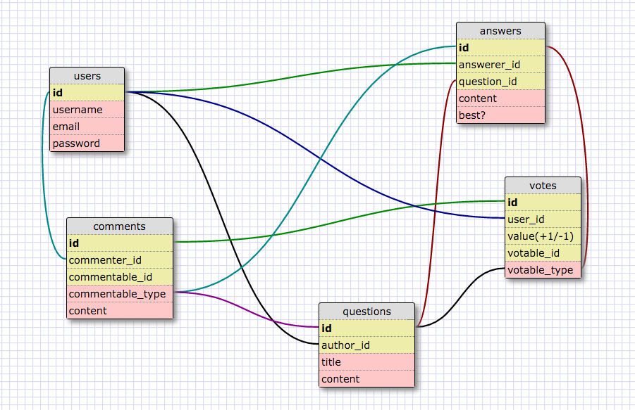

# SmackUndertone

A study of technologies, database relationships, and UX design choices of popular websites and applications.

##Description

[SmackUndertone][1] is the first of a series of webpage clones and highlights some of the core functionality of Stack Overflow. The application is built using Ruby on Rails. Currently the application has a functioning backend, and handles basic crud on the client side including adding new posts, commenting, and up voting.

## Technologies

* Rails 4
* HTML5
* Bootstrap
* JavaScript
* PostgreSQL
* Full markdown and syntax highlighting support(admin)
* Deployed on Heroku

## Team Members
Jack
Eliza
Bruno
Eunice

## Schema Design

[1]:https://smackundertone.herokuapp.com/
